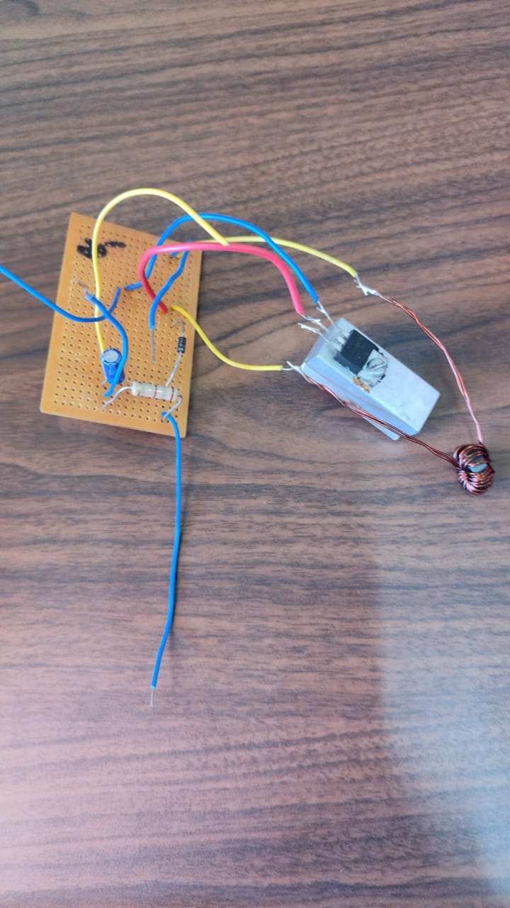
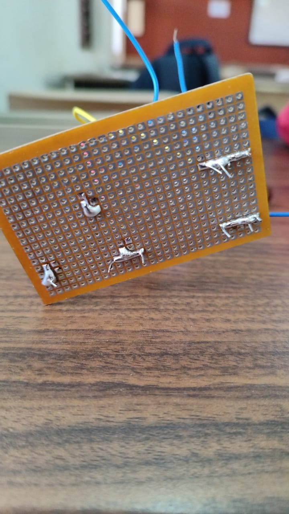
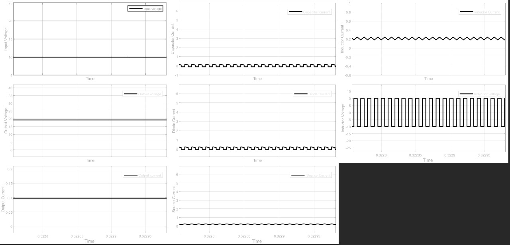

# ⚡ Design and Implementation of a Boost Converter


## 📌 Overview
Design and implementation of a DC-DC Boost Converter operating in
Continuous Conduction Mode (CCM). Steps up an input voltage range
of 10–15V to a stable output of 20V at 2W load power.
Modelled and simulated in MATLAB Simulink and validated with
real hardware implementation.

---

## ⚙️ Converter Specifications
| Parameter | Value |
|---|---|
| Input Voltage | 10V – 15V |
| Output Voltage | 20V (stable) |
| Load Power | 2W |
| Operating Mode | Continuous Conduction Mode (CCM) |
| Switching Control | PWM (Discrete Pulse Generator) |

---

## 📊 MATLAB Simulink Model

### `matlab/labdc3b.slx` — Boost Converter Simulation
Simulates the full boost converter circuit:
- DC Voltage Source (10–15V input)
- Output voltage stepped up to stable 20V
- Capacitor current waveform
- Source current waveform
- PWM switching control (Discrete Pulse Generator)

To open: Launch MATLAB → Open `matlab/boost_converter.slx`

---

## 🛠️ Hardware Components
| Component | Specification |
|---|---|
| Inductor | Custom wound toroidal inductor |
| MOSFET Switch | Power MOSFET (switching element) |
| Diode | Fast recovery diode |
| Capacitor | Output filter capacitor |
| PCB | Perfboard prototype |
| Input | 10–15V DC supply |
| Output | 20V DC, 2W |

---

## 📁 Project Structure
```
boost-converter-matlab/
├── matlab/
│   └── boost_converter.slx               # MATLAB Simulink boost converter model
└── docs/
    ├── graph.jpeg                 # Simulink simulation waveforms
    ├── boost_convert.jpeg         # Hardware circuit photo
    ├── boost_convert1.jpeg        # PCB bottom view
    └── boost_convert_video.mp4    # Hardware demo video
```

---

## 🚀 How to Run Simulation

```
1. Open MATLAB
2. Open matlab/boost_converter.slx
3. Run simulation
4. View scope outputs:
   - Input Voltage (10–15V DC source)
   - Output Voltage (stepped up to stable 20V)
   - Capacitor current waveform
   - Source current waveform
   - PWM switching waveforms
```

---

## 📸 Hardware Implementation

| Full Circuit | PCB Bottom View |
|---|---|
|  |  |

> Real hardware prototype showing toroidal inductor, MOSFET switch,
> diode, and capacitor assembled on perfboard.

---

## 📊 Simulation Waveforms


> MATLAB Simulink scope outputs showing stable 20V output,
> capacitor & source current waveforms, and PWM switching signals.

---

## 🎥 Demo Video
| Video | Description |
|---|---|
| [boost_convert_video.mp4](docs/boost_convert_video.mp4) | Hardware boost converter in operation |

---

## 👤 Author
**Achuoth Akol Achuoth Deng**
B.Tech EEE — Amrita Vishwa Vidyapeetham, India
[LinkedIn](https://linkedin.com/in/achuoth-akol-achuoth-deng) · [GitHub](https://github.com/Achuoth11)
